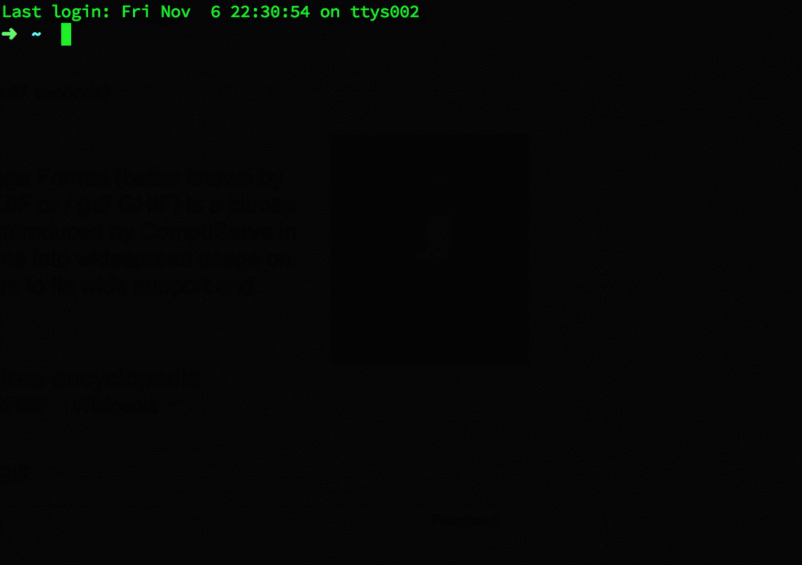

# pve
---
####Python Virtualenv Manager

Prototype made in Facebook Seattle Hackathon, idea inspired by [n](https://github.com/tj/n)

####Installation
Install python virtualenv by pip first.

One easy way is use "ln" to create symlink in /usr/local/bin, and chmod 755 to pve file.

####TODO:
- [ ] Find better solution for activate and source.
- [ ] Make shareable virtualenv instance, and can be download, install within one line
- [ ] Test Script

####Activate Problem
Using __source__ in bash script is not working well.